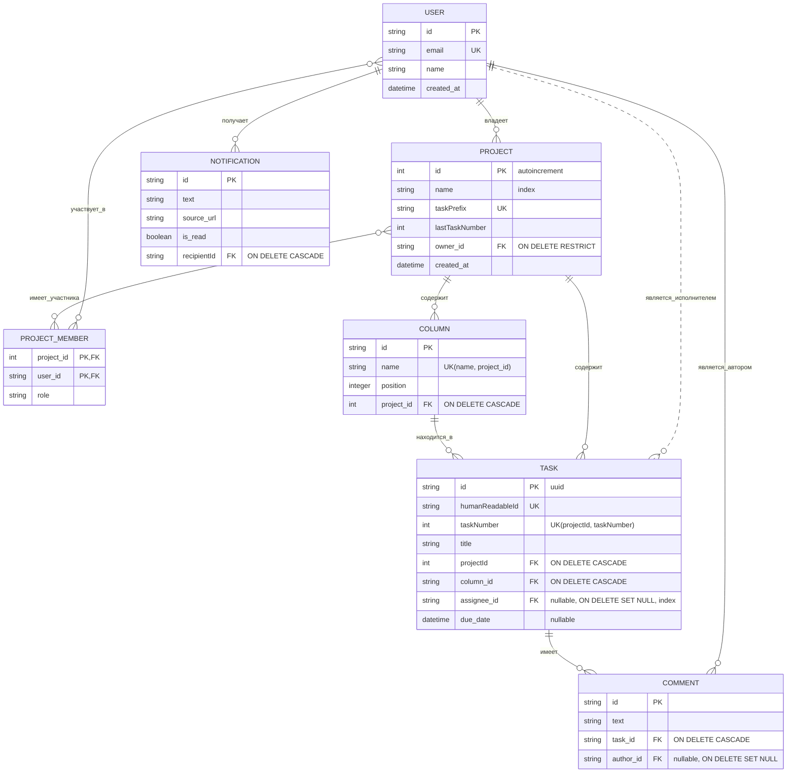

# Database Schema: Mutabor

## 1. ERD (Entity-Relationship Diagram)

Эта диаграмма является визуальным представлением финальной структуры базы данных, связей и ключевых ограничений целостности данных.

## 2. Описание таблиц и правил

| Таблица / Поле             | Тип данных         | Ограничения                                       | Описание                                                                  |
| -------------------------- | ------------------ | ------------------------------------------------- | ------------------------------------------------------------------------- |
| **PROJECT**                |                    |                                                   | Проекты или Kanban-доски.                                                 |
| `id`                       | `Int`              | `PRIMARY KEY`, `AUTO_INCREMENT`                   | Уникальный числовой ID проекта. Используется в URL.                       |
| `taskPrefix`               | `string`           | `UNIQUE`, `NOT NULL`                              | Короткий префикс для задач проекта (например, "PHX").                     |
| `lastTaskNumber`           | `Int`              | `DEFAULT 0`                                       | Счетчик последнего номера задачи в проекте.                               |
| `owner_id`                 | `string` (UUID)    | `FK to USER(id)`, `ON DELETE RESTRICT`            | Владелец проекта. Удаление пользователя-владельца запрещено.              |
| **TASK**                   |                    |                                                   | Атомарные задачи.                                                         |
| `id`                       | `string` (UUID)    | `PRIMARY KEY`                                     | Внутренний, невидимый пользователю ID.                                    |
| `humanReadableId`          | `string`           | `UNIQUE`                                          | Человеко-понятный ID (например, "PHX-1"). Используется в URL.             |
| `(projectId, taskNumber)`  | `(Int, Int)`       | `UNIQUE`                                          | Номер задачи уникален в рамках одного проекта.                             |
| `projectId`                | `Int`              | `FK to PROJECT(id)`, `ON DELETE CASCADE`          | Связь с проектом для генерации ID и каскадного удаления.                  |
| `assignee_id`              | `string` (UUID)    | `FK to USER(id)`, `ON DELETE SET NULL`, `NULLABLE` | Исполнитель. При удалении пользователя становится `NULL`.                 |
| **COMMENT**                |                    |                                                   | Комментарии к задачам.                                                    |
| `author_id`                | `string` (UUID)    | `FK to USER(id)`, `ON DELETE SET NULL`, `NULLABLE` | Автор. При удалении пользователя становится `NULL` (анонимизируется).      |
| **NOTIFICATION**           |                    |                                                   | Уведомления для пользователей.                                            |
| `recipientId`              | `string` (UUID)    | `FK to USER(id)`, `ON DELETE CASCADE`             | Получатель. При удалении пользователя его уведомления удаляются.          |