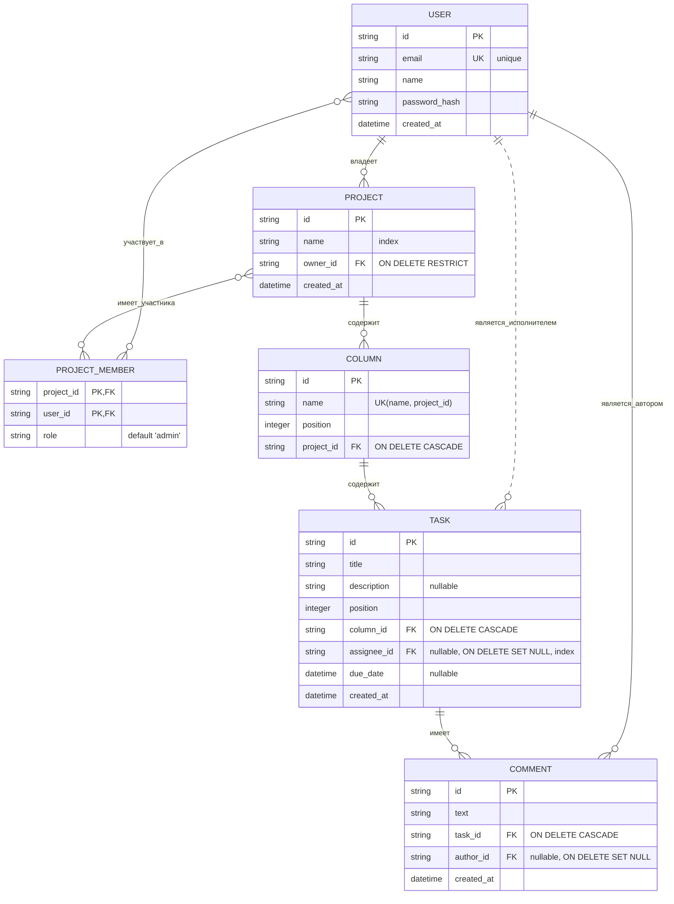

# Database Schema: Mutabor

## 1. ERD (Entity-Relationship Diagram)

Эта диаграмма является визуальным представлением структуры базы данных, связей и ключевых ограничений целостности данных.

## 2. Описание таблиц, полей и правил целостности

### Таблица: `USER`
-   **Описание:** Пользователи системы.
| Поле            | Тип               | Ограничения                | Индекс | Описание                                        |
| --------------- | ----------------- | -------------------------- | ------ | ----------------------------------------------- |
| `id`            | `string` (UUID)   | `PRIMARY KEY`              | -      | Уникальный идентификатор пользователя.          |
| `email`         | `string`          | `UNIQUE`, `NOT NULL`       | Да     | Email для входа, должен быть уникальным.        |
| `name`          | `string`          | `NOT NULL`                 | -      | Отображаемое имя пользователя.                  |
| `password_hash` | `string`          | `NOT NULL`                 | -      | Хеш пароля.                                     |
| `created_at`    | `datetime`        | `DEFAULT NOW()`            | -      | Дата создания аккаунта.                         |

---
### Таблица: `PROJECT`
-   **Описание:** Проекты или Kanban-доски.
| Поле         | Тип               | Ограничения                               | Индекс | Описание                                        |
| ------------ | ----------------- | ----------------------------------------- | ------ | ----------------------------------------------- |
| `id`         | `string` (UUID)   | `PRIMARY KEY`                             | -      | Уникальный идентификатор проекта.               |
| `name`       | `string`          | `NOT NULL`                                | **Да** | Название проекта. Индексируется для быстрого поиска. |
| `owner_id`   | `string` (UUID)   | `FOREIGN KEY to USER(id)`, `ON DELETE RESTRICT` | Да     | Владелец проекта. Удаление пользователя-владельца **запрещено**. |
| `created_at` | `datetime`        | `DEFAULT NOW()`                           | -      | Дата создания проекта.                          |

---
### Таблица: `PROJECT_MEMBER`
-   **Описание:** Связующая таблица для участников проекта (роли "многие-ко-многим").
| Поле         | Тип               | Ограничения                               | Индекс | Описание                                        |
| ------------ | ----------------- | ----------------------------------------- | ------ | ----------------------------------------------- |
| `project_id` | `string` (UUID)   | `PRIMARY KEY`, `FOREIGN KEY to PROJECT(id)` | -      | Идентификатор проекта.                          |
| `user_id`    | `string` (UUID)   | `PRIMARY KEY`, `FOREIGN KEY to USER(id)`    | -      | Идентификатор пользователя.                     |
| `role`       | `string`          | `DEFAULT 'admin'`                         | -      | Роль в проекте ('admin', 'member'). По умолчанию администратор, чтобы обеспечить наличие хотя бы одного. |

---
### Таблицы: `COLUMN`, `TASK`, `COMMENT`
-   **Описание:** Основные сущности рабочего процесса.
| Таблица / Поле         | Тип               | Ограничения                               | Индекс | Описание                                        |
| ---------------------- | ----------------- | ----------------------------------------- | ------ | ----------------------------------------------- |
| **COLUMN**             |                   |                                           |        | Колонки на доске.                               |
| `(name, project_id)`   | `(string, string)`| `UNIQUE`                                  | Да     | Название колонки **уникально в рамках одного проекта**. |
| `position`             | `integer`         | `NOT NULL`                                | -      | Порядок колонки на доске.                       |
| `project_id`           | `string` (UUID)   | `FOREIGN KEY to PROJECT(id)`, `ON DELETE CASCADE` | Да     | При удалении проекта **удаляются все его колонки**. |
| **TASK**               |                   |                                           |        | Атомарные задачи.                               |
| `assignee_id`          | `string` (UUID)   | `FOREIGN KEY to USER(id)`, `ON DELETE SET NULL`, `NULLABLE` | **Да** | Исполнитель. При удалении пользователя **становится NULL**. |
| `due_date`             | `datetime`        | `NULLABLE`                                | -      | Срок выполнения задачи. Может отсутствовать.     |
| `column_id`            | `string` (UUID)   | `FOREIGN KEY to COLUMN(id)`, `ON DELETE CASCADE` | Да     | При удалении колонки **удаляются все ее задачи**. |
| **COMMENT**            |                   |                                           |        | Комментарии к задачам.                          |
| `author_id`            | `string` (UUID)   | `FOREIGN KEY to USER(id)`, `ON DELETE SET NULL`, `NULLABLE` | Да     | Автор. При удалении пользователя **становится NULL (анонимизируется)**. |
| `task_id`              | `string` (UUID)   | `FOREIGN KEY to TASK(id)`, `ON DELETE CASCADE` | Да     | При удалении задачи **удаляются все ее комментарии**. |
