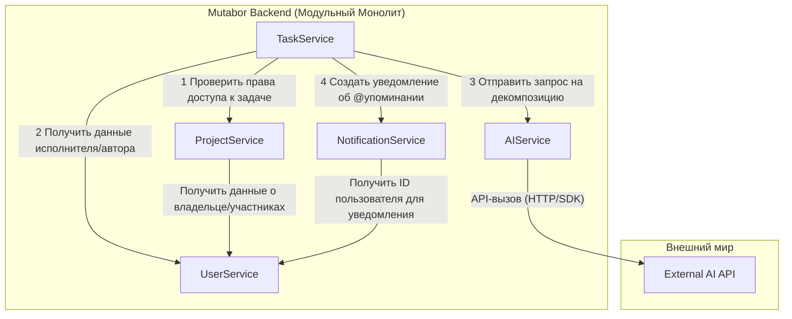

# Dependencies Map: Mutabor

## 1. Внутренние зависимости (Коммуникация между модулями)

Система строится как модульный монолит. Модули находятся в рамках одного приложения и могут взаимодействовать друг с другом напрямую через вызовы методов/функций.

- **TaskService (Модуль Задач):** Ядро бизнес-логики.
    - Зависит от **ProjectService** для проверки прав доступа пользователя к доске/задаче.
    - Зависит от **UserService** для получения информации о пользователях (кто исполнитель, кто автор комментария).
    - Зависит от **AIService** для делегирования всех AI-операций.
    - Зависит от **NotificationService** для создания записей об уведомлениях, когда пользователя упоминают.

- **ProjectService (Модуль Проектов):**
    - Зависит от **UserService** для управления списком участников проекта.

- **NotificationService (Модуль Уведомлений):**
    - Зависит от **UserService** для валидации ID пользователя, которому адресовано уведомление.
    - **Не зависит** от внешних сервисов. Его задача — только создать запись в базе данных.

- **AIService (Модуль-адаптер для AI):**
    - **Изолирован** от бизнес-логики. Предоставляет простой интерфейс (например, `decomposeTask(text)`) для других модулей.
    - Является **единственным** модулем, который знает о существовании внешнего AI API.

## 2. Внешние API

- **External AI Provider (Google Gemini / OpenAI API / etc.):**
    - **Назначение:** Предоставление возможностей LLM для декомпозиции задач, саммари и других интеллектуальных функций.
    - **Кто использует:** Только `AIService`.
    - **Статус:** Единственная внешняя зависимость для MVP, критически важная для УТП.

## 3. Существующие и новые модели данных

- **Существующие модели:**
    - `User`: Хранит `id`, `name`, `email`, `password_hash`.
    - `Project`: Хранит `id`, `name`, `owner_id`.
    - `ProjectMember`: Таблица-связка `project_id` и `user_id`.
    - `Column`: Хранит `id`, `name`, `project_id`, `order`.
    - `Task`: Хранит `id`, `title`, `description`, `column_id`, `assignee_id`.
    - `Comment`: Хранит `id`, `text`, `author_id`, `task_id`.

- **Новые модели:**
    - `Notification`: Таблица для хранения уведомлений. Должна содержать:
        - `id`: Уникальный идентификатор.
        - `recipient_id`: FK на `User(id)`, кому адресовано.
        - `text`: Содержание уведомления (например, "Вас упомянули в задаче X").
        - `source_url`: Ссылка для перехода (например, `/projects/1/tasks/123`).
        - `is_read`: boolean-флаг (прочитано/не прочитано).
        - `created_at`: timestamp.

## 4. Новые компоненты (что нужно создать)

### Backend (Модульный Монолит):
- `UserService`: Логика регистрации, аутентификации (email/пароль), управление профилями.
- `ProjectService`: CRUD для досок, колонок, управление доступом и участниками.
- `TaskService`: CRUD для задач и комментариев. Обработка @упоминаний.
- `NotificationService`: CRUD для уведомлений. Логика пометки уведомлений как прочитанных.
- `AIService` (Адаптер): Логика формирования промптов, вызов внешнего AI API, обработка ответов и ошибок.
- `RealtimeGateway` (WebSocket): Модуль для управления WebSocket-соединениями и рассылки событий (`task_created`, `notification_new`, и т.д.) на клиент.

### Frontend:
- `AuthPage`: Компонент с формами регистрации и входа по email/паролю.
- `BoardView`: Основной компонент-доска, обрабатывающий drag-n-drop и real-time обновления.
- `TaskModal`: Модальное окно с полной информацией о задаче, включая комментарии.
- `AIHelperButton`: UI-кнопка (например, с иконкой "✨") внутри `TaskModal`, которая инициирует вызовы AI-функций.
- `NotificationBell`: Компонент в шапке приложения (хедере) с иконкой-колокольчиком, счетчиком непрочитанных уведомлений и выпадающим списком при клике.
