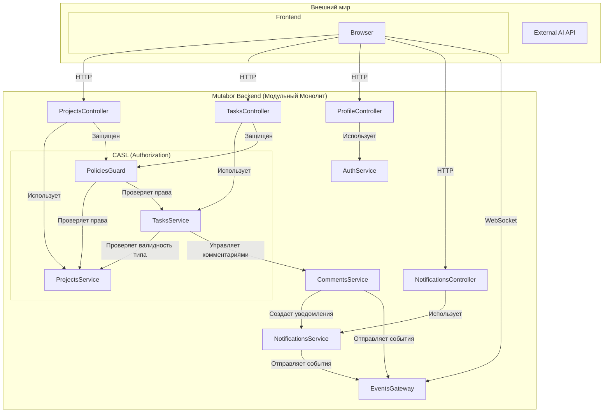

# Dependencies Map: Mutabor

## 1. Внутренние зависимости (Коммуникация между модулями)

Система строится как модульный монолит. Модули взаимодействуют через DI-контейнер Nest.js.

- **`PoliciesGuard` (Гард Авторизации):** Центральный элемент проверки прав. Зависит от `ProjectsService` и `TasksService` для получения контекста (проекта, задачи) и определения роли пользователя.
- **`ProjectsService` / `TasksService`:** Ядра бизнес-логики. Теперь они не содержат логику проверки прав, а просто предоставляют данные для `PoliciesGuard`.
- **`CommentsService`:** Делегирует создание уведомлений об упоминаниях в `NotificationsService`.
- **`NotificationsService`:** Новый, изолированный сервис. Отвечает за создание записей об уведомлениях в БД и отправку real-time событий через `EventsGateway`.

## 2. Новые компоненты (что создано)

### Backend:
- `ProfileController`: Эндпоинты для управления профилем (`/profile/me`, `/profile/change-password`).
- `NotificationsService` & `NotificationsController`: CRUD и бизнес-логика для уведомлений.
- `PoliciesGuard`: Глобальный гвард для проверки ролевой модели доступа.
- `@CheckPolicies` & `PolicyHandler`: Декораторы и обработчики для декларативного описания правил доступа.

### Frontend (что потребуется создать):
- `ProfilePage`: Страница для редактирования имени и смены пароля.
- `NotificationBell`: Компонент с иконкой-колокольчиком, который слушает WebSocket-событие `notification:new`.
- **Обработка ошибок 403 Forbidden:** UI должен корректно реагировать, если пользователь пытается выполнить действие, на которое у него нет прав (например, скрывать кнопки "Настройки" для `editor`).
