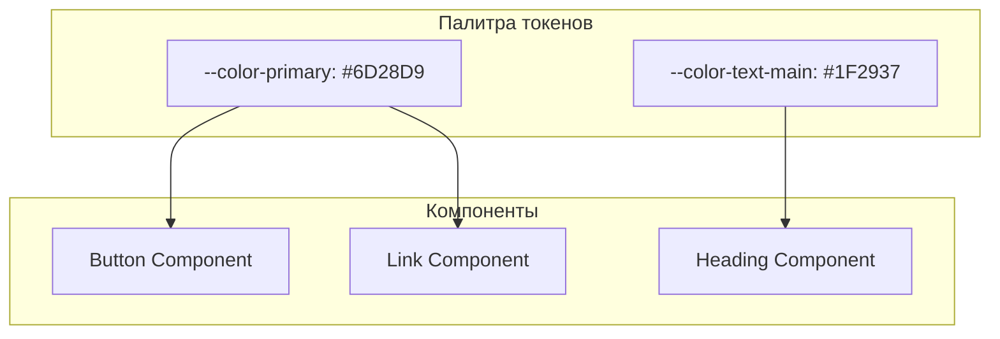

# Design System: Mutabor

## 1. Руководящие принципы

"Mutabor" — это профессиональный инструмент, созданный для максимальной продуктивности. Дизайн должен быть чистым, сдержанным и предсказуемым. Каждый элемент интерфейса служит одной цели — помочь пользователю сфокусироваться на задачах, а не на самом интерфейсе.

-   **Минимум визуального шума:** Мы избегаем лишних украшений, градиентов и кричащих анимаций.
-   **Функциональность превыше всего:** Эстетика важна, но она никогда не должна мешать удобству использования.
-   **Предсказуемость:** Пользователь должен интуитивно понимать, как работает каждый элемент управления.

## 2. Цветовая палитра (Design Tokens)

Цвета определены как CSS-переменные (токены) для обеспечения глобальной консистентности.

-   **Primary (Accent):** `var(--color-primary)`
    -   **HEX:** `#6D28D9` (Глубокий, спокойный фиолетовый)
    -   **Назначение:** Основные кнопки, ссылки, активные поля ввода, иконки.

-   **Semantic Colors:**
    -   **Success:** `var(--color-success)` - `#10B981` (Зеленый)
    -   **Error/Danger:** `var(--color-error)` - `#EF4444` (Красный)
    -   **Warning:** `var(--color-warning)` - `#F59E0B` (Янтарный)
    -   **Info:** `var(--color-info)` - `#3B82F6` (Синий)

-   **Neutral Palette (Greys):**
    -   `--color-background-page`: `#F9FAFB` (Почти белый, легкий оттенок)
    -   `--color-background-element`: `#FFFFFF` (Чистый белый для карточек и модальных окон)
    -   `--color-border`: `#E5E7EB` (Светло-серые границы)
    -   `--color-text-main`: `#1F2937` (Основной текст, почти черный)
    -   `--color-text-secondary`: `#6B7280` (Второстепенный текст, серый)
    -   `--color-text-disabled`: `#D1D5DB` (Текст для неактивных элементов)

## 3. Типографика

-   **Основной шрифт:** **Системный стек**. Это обеспечивает максимальную производительность и "родное" отображение на всех платформах.
    -   `font-family: -apple-system, BlinkMacSystemFont, "Segoe UI", Roboto, Helvetica, Arial, sans-serif;`
-   **Моноширинный шрифт:** **Системный стек моноширинных шрифтов**. Используется для отображения кода и технических данных.
    -   `font-family: "SF Mono", "Menlo", "Consolas", "Courier New", monospace;`
-   **Шкала размеров (Type Scale):**
    -   H1: `32px`, `font-weight: 700`
    -   H2: `24px`, `font-weight: 600`
    -   H3: `20px`, `font-weight: 600`
    -   Body (p): `16px`, `font-weight: 400`
    -   Caption: `14px`, `font-weight: 400`

## 4. Сетка и отступы (Spacing System)

-   **Базовая единица (Base Unit):** `8px`.
-   **Правило:** Все отступы (margin, padding) и размеры элементов должны быть кратны базовой единице (например, `padding: 16px 24px`). Это создает предсказуемый визуальный ритм.

## 5. UI Kit: Основные компоненты

Здесь описывается внешний вид и состояния ключевых компонентов. Это основа для библиотеки компонентов в React.

-   **Button:**
    -   **Variants:** `primary` (заливка `var(--color-primary)`), `secondary` (прозрачный фон, рамка `var(--color-border)`), `danger`.
    -   **States:** `default`, `hover` (легкое осветление/затемнение), `focus` (добавление `outline`), `disabled` (цвет `var(--color-text-disabled)`).
    -   **Border Radius:** `6px`.

-   **Input:**
    -   **States:**
        -   `default`: Рамка `1px solid var(--color-border)`.
        -   `focus`: Рамка `2px solid var(--color-primary)`.
        -   `error`: Рамка `2px solid var(--color-error)`.
        -   `disabled`: Фон `var(--color-background-page)`.
    -   **Border Radius:** `6px`.

-   **Modal:**
    -   **Elevation:** Используется мягкая, рассеянная тень для создания ощущения высоты.
        -   `box-shadow: 0 10px 15px -3px rgba(0, 0, 0, 0.1), 0 4px 6px -2px rgba(0, 0, 0, 0.05);`
    -   **Border Radius:** `8px`.

-   **Card (Карточка задачи):**
    -   **Background:** `var(--color-background-element)`.
    -   **Border:** `1px solid var(--color-border)`.
    -   **Border Radius:** `8px`.
    -   **Hover State:** Легкое поднятие с помощью тени, чтобы показать интерактивность.
