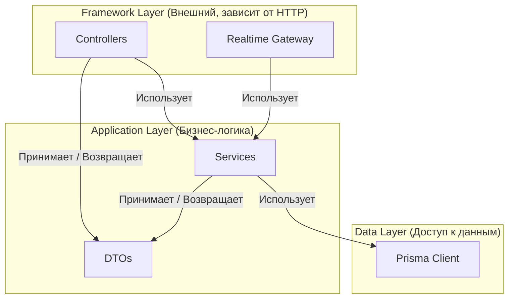

# Layer Guides: Mutabor

Этот документ — "Конституция" нашего проекта. Он определяет правила и обязанности каждого архитектурного слоя. Соблюдение этих правил гарантирует, что проект останется поддерживаемым, масштабируемым и предсказуемым. Отступления от гайдов возможны только после обсуждения всей командой.

## Backend (Nest.js)

Архитектура бэкенда следует принципам чистой архитектуры, где зависимости направлены строго от внешних слоев к внутренним.



---

### 1. Controller Layer Guide (`*.controller.ts`)

-   **Назначение:** Единственная точка соприкосновения с миром HTTP. Преобразует HTTP-запросы в вызовы методов сервиса.
-   **Принципы:**
    -   **Ультра-тонкий:** Контроллер не содержит никакой бизнес-логики. Его задача — распарсить запрос и вызвать **один** метод в сервисе.
    -   **Строгая работа с DTO:** Все входящие данные валидируются через DTO с помощью `@nestjs/class-validator`. Все ответы клиенту — это DTO, возвращенные из сервиса.
    -   **Никакого доступа к данным:** Категорически запрещено использовать `PrismaClient` или любой другой способ прямого доступа к БД.
    -   **Безопасность — прежде всего:** Каждый защищенный эндпоинт должен использовать `@UseGuards(JwtAuthGuard)`.
    -   **Явное объявление ответа:** Указывайте ожидаемый HTTP-статус ответа (`@HttpCode(200)` или `@HttpCode(201)`).

---

### 2. Service Layer Guide (`*.service.ts`)

-   **Назначение:** Сердце приложения. Здесь инкапсулирована вся бизнес-логика.
-   **Принципы:**
    -   **Независимость от фреймворка:** Сервис ничего не знает о `request`, `response` и протоколе HTTP. Он принимает данные и возвращает результат.
    -   **Единственный владелец данных:** Только сервисы имеют право обращаться к базе данных через `PrismaClient`.
    -   **Оркестрация:** Если бизнес-процесс требует вызова нескольких других сервисов (например, `AiService`, `NotificationService`), эта оркестрация происходит здесь.
    -   **Обработка ошибок:**
        -   **Генерирует бизнес-исключения:** Если операция не может быть выполнена (например, "задача не найдена", "доступ запрещен"), сервис выбрасывает кастомное, понятное исключение (`TaskNotFoundException`).
        -   **Не ловит технические ошибки:** Ошибки подключения к БД или другие системные сбои "пробрасываются" наверх, где их ловит глобальный `ExceptionFilter` и возвращает клиенту стандартизированный `500 Internal Server Error`.
    -   **Транзакционность:** Все операции, которые изменяют несколько сущностей, должны быть обернуты в транзакцию (`this.prisma.$transaction(...)`) для обеспечения целостности данных.

---

## Frontend (React)

Архитектура фронтенда строится по методологии **Feature-Sliced Design (FSD)**. Это обеспечивает максимальную модульность и управляемость зависимостей.

-   **Структура папок:**
    ```
    /src
      /app        # Инициализация приложения (роутер, стор, провайдеры)
      /pages      # Страницы, которые компонуют виджеты и фичи
      /widgets    # Сложные, независимые UI-блоки (например, Header, ProjectSidebar)
      /features   # Бизнес-логика, доступная пользователю (AuthByEmail, CreateTask)
      /entities   # Бизнес-сущности (User, Task, Project)
      /shared     # Переиспользуемый код без бизнес-логики (UI-кит, конфиг API)
    ```

-   **Правило импортов (The Slices Rule):** Слои могут импортировать только из слоев, находящихся строго ниже по иерархии.
    -   ✅ `pages` могут импортировать из `widgets`, `features`, `entities`, `shared`.
    -   ❌ `features` **не могут** импортировать из `widgets` или `pages`.
    -   Это правило — закон. Оно предотвращает "спагетти-код" и гарантирует поддерживаемость.

-   **Внутренняя структура слайса (фичи/сущности):**
    -   `/ui`: "Глупые" UI-компоненты, которые получают всё через props.
    -   `/model`: Логика и управление состоянием (хуки, сервисы API, стейт-менеджеры).
    -   `/lib`: Вспомогательные функции, специфичные для этого слайса.
    -   `index.ts`: "Публичное API" слайса. Только то, что экспортируется из этого файла, может быть использовано другими слоями.
