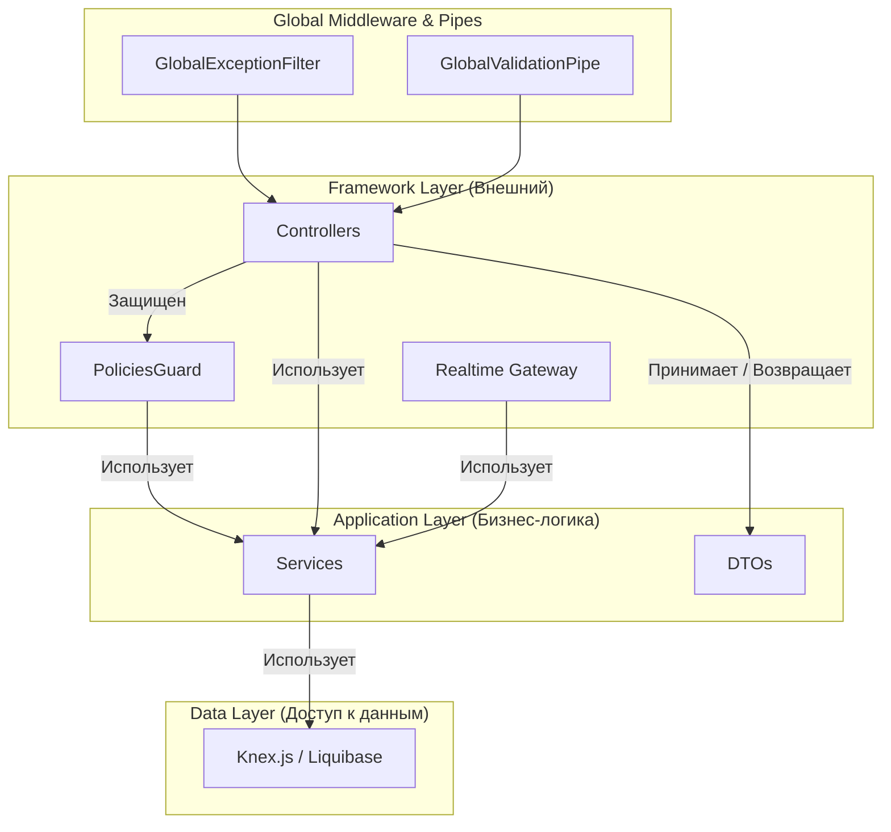

# Layer Guides: Mutabor

Этот документ — "Конституция" нашего проекта. Он определяет правила и обязанности каждого архитектурного слоя.

## Backend (Nest.js)

Архитектура следует принципам чистой архитектуры и лучших практик Nest.js.



### 0. Глобальный уровень
- **`GlobalExceptionFilter`:** Единственная точка обработки всех ошибок. Форматирует ответы в стандартный JSON. Отвечает за логирование ошибок.
- **`GlobalValidationPipe`:** Единственная точка валидации всех входящих DTO. Гарантирует, что до контроллеров доходят только валидные данные.

### 1. Controller & Guard Layer (`*.controller.ts`, `*.guard.ts`)
- **Назначение:** Точка соприкосновения с миром HTTP и авторизации.
- **Принципы:**
    - **Ультра-тонкий контроллер:** Не содержит бизнес-логики. Его задача — распарсить запрос, вызвать **один** метод в сервисе и вернуть результат.
    - **Декларативная авторизация:** Права доступа **не проверяются** внутри контроллера. Вместо этого используется гвард `PoliciesGuard` и декоратор `@CheckPolicies` для декларативного описания необходимых прав.
    - **Строгая работа с DTO:** Все входящие и исходящие данные — это DTO.

### 2. Service Layer Guide (`*.service.ts`)
- **Назначение:** Сердце приложения. Здесь инкапсулирована вся бизнес-логика.
- **Принципы:**
    - **Независимость от фреймворка:** Сервис ничего не знает о `request`, `response` и HTTP.
    - **Владелец данных:** Только сервисы имеют право обращаться к базе данных.
    - **Оркестрация:** Сервис может вызывать другие сервисы (`NotificationsService`, `ProjectsService`) для выполнения сложных бизнес-процессов.
    - **Транзакционность:** Все операции, изменяющие несколько сущностей, должны быть обернуты в транзакцию.
    - **Не содержит логики прав доступа:** Сервис может предоставлять методы для получения роли пользователя (как `getProjectAndRole`), но финальное решение "можно/нельзя" принимает `PoliciesGuard`.

## Frontend (React)
Архитектура фронтенда строится по методологии **Feature-Sliced Design (FSD)**.

- **Структура папок:**
    ```
    /src
      /app        # Инициализация (роутер, стор, провайдеры)
      /pages      # Компоновка виджетов и фич
      /widgets    # Сложные UI-блоки (Header, ProjectSidebar)
      /features   # Бизнес-логика (AuthByEmail, CreateTask, AddComment)
      /entities   # Бизнес-сущности (User, Task, Project)
      /shared     # Переиспользуемый код (UI-кит, конфиг API, lib)
    ```

- **Правило импортов (The Slices Rule):** Слои могут импортировать только из слоев, находящихся строго ниже.
    -   ✅ `pages` могут импортировать из `widgets`, `features`, `entities`, `shared`.
    -   ❌ `features` **не могут** импортировать из `widgets` или `pages`.
