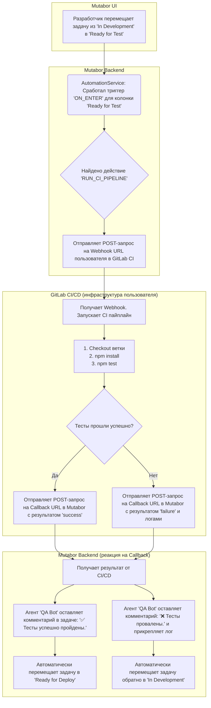

# Solution Design: "Mutabor"

## 1. Цель

Создать интеллектуальную платформу для автоматизации разработки (Developer Platform), построенную вокруг Kanban-доски. Продукт предназначен для небольших команд (2-15 человек), которые хотят не просто отслеживать задачи, а автоматизировать рутинные процессы разработки, тестирования и документирования с помощью настраиваемых AI-агентов и Git-интеграции.

## 2. Ключевые особенности и УТП

### 2.1. Kanban-доска как центр управления
- **Проекты (Доски):** Пространства для организации задач, каждый из которых привязан к собственному Git-репозиторию.
- **Колонки (Статусы):** Настраиваемые этапы жизненного цикла задачи.
- **Задачи (Карточки):** Атомарные рабочие элементы, являющиеся контейнерами для "артефактов".

### 2.2. GitOps: Репозиторий как единственный источник истины
- **Артефакты в Git:** Весь контекст задачи (ТЗ, код, документация, тесты) хранится не в базе данных, а в файлах Git-репозитория проекта. Mutabor работает с этими файлами напрямую.
- **Коммиты от имени агентов:** Все изменения, внесенные AI-агентами, коммитятся в репозиторий, обеспечивая полную прозрачность и историю изменений.

### 2.3. УТП: Настраиваемая AI-автоматизация
- **Системные AI-агенты:** В Mutabor "агент" — это системный пользователь с настраиваемым AI-профилем (провайдер, модель, ключ, системный промпт). Агенты могут быть назначены на задачи, оставлять комментарии и изменять артефакты в Git.
- **Конструктор автоматизаций:** Пользователи могут без кода настраивать цепочки "Триггер -> Действия" для каждой колонки на доске.
- **Безопасная интеграция с CI/CD:** Запуск тестов и других пайплайнов делегируется внешней CI/CD системе (например, GitLab CI) через механизм вебхуков, что обеспечивает безопасность и гибкость.

## 3. Ограничения

- **Платформа:** Веб-приложение.
- **Производительность:** Отклик интерфейса < 200 мс. Операции с Git и AI выполняются асинхронно в фоновом режиме.
- **Надежность:** Uptime сервиса — 99.8%. Данные не должны теряться.

## 4. Ожидаемый результат

- **Функциональное веб-приложение** с Kanban-доской, интегрированной с Git.
- **Модульная система** для определения и запуска автоматизаций.
- **Интерфейс для управления** проектами, репозиториями, агентами и автоматизациями.
- **Четкий, версионированный RESTful API (`/api/v1`)** с документацией (Swagger).
- **Real-time обновления** через WebSockets для отслеживания статуса автоматизаций.

## 5. Архитектура и Технологии

- **Frontend:** React.
- **Backend:** Nest.js.
- **База данных:** PostgreSQL (миграции через Liquibase).
- **Real-time:** Socket.IO.
- **Git-интеграция:** Библиотека `simple-git` на бэкенде.
- **CI/CD Интеграция:** Webhooks (приоритетная поддержка для GitLab CI).

## 6. Ключевые сущности данных (Data Model)

Актуальная и единственно верная схема базы данных и ERD-диаграмма находятся в документе **[Database Schema.md](./Database%20Schema.md)**. Этот подход исключает рассинхронизацию между документами.

## 7. Основные флоу (User & System Flows)

### Флоу: Автоматическое тестирование и деплой кода

**Цель:** Продемонстрировать полный цикл автоматизации от написания кода до его тестирования.

