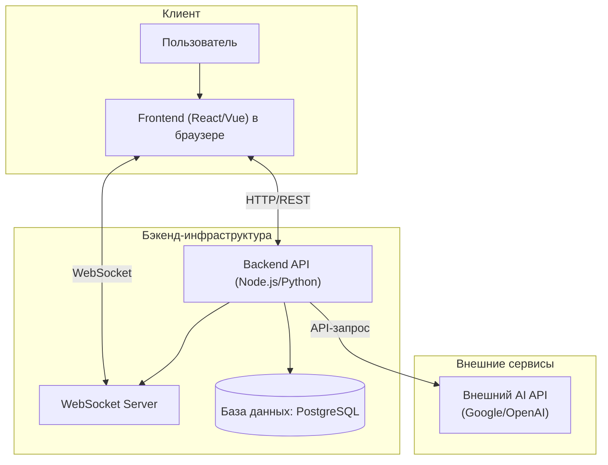
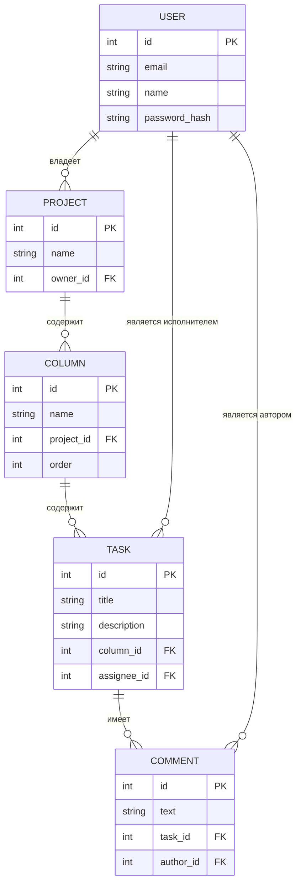

# Solution Design: "Mutabor"

## 1. Цель

Создать интеллектуальный таск-менеджер "Mutabor" в формате веб-приложения. Продукт предназначен для небольших команд (2-15 человек), которым нужен простой инструмент для визуализации рабочих процессов на Kanban-доске и эффективной совместной работы. Ключевая цель — повысить продуктивность команды за счет интеграции AI-ассистента, который автоматизирует рутинные операции по планированию и анализу задач.

## 2. Ключевые особенности и УТП (Уникальное Торговое Предложение)

### 2.1. Классический Kanban
- **Проекты (Доски):** Пространства для организации задач команды.
- **Колонки:** Настраиваемые этапы рабочего процесса (например, "To Do", "In Progress", "Done").
- **Задачи (Карточки):** Атомарные рабочие элементы, которые перемещаются по колонкам.

### 2.2. Функции для совместной работы
- **Назначение исполнителей:** У каждой задачи может быть один ответственный пользователь.
- **Комментарии:** Обсуждение деталей задачи прямо в карточке.
- **@упоминания:** Возможность упомянуть коллегу в комментарии для привлечения его внимания, с отправкой уведомления.

### 2.3. УТП: AI-ассистент "Mutabor AI"
AI-ассистент интегрируется непосредственно в рабочий процесс для помощи команде. Используются внешние LLM-провайдеры (Google API, OpenAI, и т.д.).

- **Умная декомпозиция задач:** Пользователь создает общую задачу (например, "Разработать фичу авторизации"), а AI разбивает её на конкретные подзадачи (чек-лист внутри карточки): "Создать UI/UX макет", "Написать API эндпоинты", "Реализовать frontend-логику", "Написать тесты".
- **Автоматические саммари (итоги):** AI может генерировать краткое содержание длинной переписки в комментариях к задаче или составлять еженедельный отчет о прогрессе по задачам конкретного пользователя.
- **Помощь в работе с кодом:** Для технических задач AI может предложить название для git-ветки, шаблон commit-сообщения или базовый сниппет кода для старта.
- **Предложение исполнителя:** На основе анализа текста задачи и истории выполненных задач, AI может предложить наиболее подходящего исполнителя из команды.

## 3. Ограничения

- **Платформа:** MVP будет доступен только как веб-приложение (в браузере).
- **Производительность:**
    - Отклик интерфейса на действия (drag-n-drop, открытие задачи): < 200 мс.
    - Загрузка доски (до 100 задач): < 2 секунды.
- **Надежность:** Uptime сервиса — 99.8%. Данные не должны теряться.
- **Масштабируемость:** На старте система должна поддерживать до 1,000 одновременно активных пользователей.
- **Зависимость от AI:** Стабильность AI-функций напрямую зависит от внешних API. Необходимо предусмотреть graceful degradation (корректную работу приложения при недоступности AI-сервиса), обработку ошибок, квот и задержек.

## 4. Ожидаемый результат

- **Функциональное веб-приложение**, реализующее базовый Kanban-функционал.
- **Интеграционный модуль** для взаимодействия с внешними AI-провайдерами, который легко адаптировать под разные модели.
- **Четкий RESTful API** с документацией (OpenAPI/Swagger) для взаимодействия фронтенда и бэкенда.
- **Real-time обновления** интерфейса для всех участников доски через WebSockets.

## 5. Архитектура и Технологии

Предполагается классическая трехуровневая архитектура с отдельным сервисом для real-time коммуникаций и внешней зависимостью в виде AI API.

- **Frontend:** React / Vue.js (для создания интерактивного SPA).
- **Backend:** Node.js (Express/Nest.js) или Python (Django/FastAPI).
- **База данных:** PostgreSQL (надежная реляционная СУБД для хранения структурированных данных).
- **Real-time:** Socket.IO или чистые WebSockets.

## 6. Ключевые сущности данных (Data Model)

## 7. Основные флоу (User & System Flows)

### Флоу 1: Создание и перемещение задачи (базовый)
1.  **Пользователь** кликает "Добавить задачу" в колонке "To Do".
2.  **Frontend** отправляет `POST /api/v1/tasks` запрос.
3.  **Backend** создает задачу в БД, привязывая её к колонке и проекту.
4.  **Backend** через WebSocket рассылает событие `task_created` всем участникам проекта.
5.  **Все участники** видят новую задачу на доске в реальном времени.

### Флоу 2: Упоминание пользователя в комментарии
1.  **Пользователь А** пишет комментарий к задаче: "Отличная работа, @ПользовательБ!".
2.  **Frontend** отправляет `POST /api/v1/tasks/{id}/comments` с текстом комментария.
3.  **Backend** сохраняет комментарий. Парсит текст, находит `@ПользовательБ` и его ID.
4.  **Backend** создает уведомление для **Пользователя Б** (в БД и/или отправляет email/push).
5.  **Backend** через WebSocket рассылает событие `comment_created`.
6.  **Все участники** видят новый комментарий.

### Флоу 3: Декомпозиция задачи с помощью AI
1.  **Пользователь** создает задачу "Настроить CI/CD для проекта" и нажимает кнопку "✨ Улучшить с AI".
2.  **Frontend** отправляет запрос `POST /api/v1/tasks/{id}/decompose`.
3.  **Backend** получает запрос. Формирует промпт для AI: `Разбей следующую задачу на подзадачи в формате JSON-массива: "Настроить CI/CD для проекта"`.
4.  **Backend** отправляет запрос к **Внешнему AI API**.
5.  **AI API** возвращает `["Настроить сборку Docker-образа", "Написать пайплайн для GitLab CI", "Настроить деплой на staging-сервер"]`.
6.  **Backend** парсит ответ и добавляет эти пункты в описание задачи или в виде чек-листа.
7.  **Backend** через WebSocket рассылает событие `task_updated` с обновленными данными.
8.  **Frontend** пользователя обновляет карточку задачи, отображая сгенерированный чек-лист.

## 8. MVP и План развития

### MVP (Минимально жизнеспособный продукт)
- Регистрация и аутентификация пользователей.
- Создание проектов (досок).
- Создание, редактирование, удаление колонок.
- Создание, редактирование, удаление и перемещение задач (карточек) между колонками.

> **Цель MVP:** Проверить базовую гипотезу о востребованности простого Kanban-инструмента.

### Post-MVP (Ближайшие шаги развития)
1.  **Функции коллаборации:**
    - Приглашение пользователей в проект.
    - Назначение исполнителей на задачи.
    - Комментарии и @упоминания с уведомлениями.
2.  **Базовая интеграция AI:**
    - Реализация флоу "Умная декомпозиция задач" (создание чек-листа).

### Дальнейшее развитие (Future Roadmap)
- Расширение возможностей AI-ассистента (саммари, генерация кода, предложение исполнителей).
- Вложения файлов в задачи.
- Метки (теги) и фильтрация по ним.
- Интеграции с внешними сервисами (GitHub, Slack, Google Calendar).
- Отчеты и аналитика по продуктивности команды.
