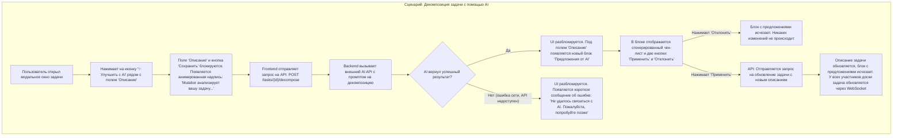

## User Flow Diagrams

### 1. Путь нового пользователя (Onboarding)

**Цель:** Провести пользователя от лендинга до его первой пустой доски максимально быстро и безболезненно, создав ощущение легкости и контроля.

```mermaid
graph TD
    subgraph "Сценарий: Первый контакт и регистрация"
        A[Пользователь заходит на лендинг-страницу] --> B[Нажимает кнопку 'Начать бесплатно' или 'Зарегистрироваться'];
        B --> C[Переходит на страницу /register];
        C --> D{Вводит email, имя и пароль};
        D --> E[Нажимает 'Создать аккаунт'];
        E --> F[API: Создает пользователя в БД];
        F --> G{Успешно?};
        G -- Да --> I[Автоматически логинит пользователя и перенаправляет на /dashboard];
        G -- Нет (например, email уже занят) --> H[Показывает ошибку под формой: 'Пользователь с таким email уже существует'];
        I --> J["'Aha!' момент: Пользователь видит пустой дашборд с текстом 'У вас пока нет проектов' и заметной кнопкой '+ Создать проект'"];
        J --> K[Нажимает '+ Создать проект'];
        K --> L{В модальном окне вводит название проекта};
        L --> M[Нажимает 'Создать'];
        M --> N["API: Создает проект. Перенаправляет на /projects/{id}"];
        N --> O[Пользователь видит свою первую, пустую доску со стандартными колонками: 'To Do', 'In Progress', 'Done'];
    end
```

**Пошаговое описание:**
1.  **Вход:** Пользователь попадает на лендинг и инициирует регистрацию.
2.  **Регистрация:** Происходит в один шаг на странице `/register`. Валидация происходит на стороне сервера.
3.  **Первый вход:** В случае успеха пользователь сразу попадает в приложение, минуя страницу логина.
4.  **"Чистый лист":** Ему показывают пустую панель, что дает ощущение контроля и не перегружает информацией.
5.  **Создание проекта:** Простой и понятный шаг для создания первого рабочего пространства.
6.  **Результат:** Пользователь оказывается на своей Kanban-доске, готовый к работе. Весь путь занимает меньше минуты.

---

### 2. Ежедневная работа с задачей (Основной цикл)

**Цель:** Определить стандартный, интуитивно понятный и эффективный процесс создания и редактирования задачи.

```mermaid
graph TD
    subgraph "Сценарий: Жизненный цикл задачи"
        A[Пользователь находится на доске проекта] --> B[Нажимает кнопку '+ Добавить задачу' в нужной колонке];
        B --> C[Открывается модальное окно создания задачи];
        C --> D{"Заполняет поля: Название (обязательно), Описание. Выбирает исполнителя из выпадающего списка участников проекта."};
        D --> E[Нажимает 'Создать задачу'];
        E --> F[API: Создает задачу. WebSocket-событие 'task:created' рассылается всем участникам проекта];
        F --> G[Модальное окно закрывается. Новая карточка задачи плавно появляется в колонке у всех на глазах];
        
        G --> H[Позже пользователь кликает на существующую задачу];
        H --> I[Открывается то же самое модальное окно, но уже с заполненными данными задачи];
        I --> J{Редактирует нужные поля};
        J --> K[Нажимает 'Сохранить'];
        K --> L[API: Обновляет задачу. WebSocket-событие 'task:updated' рассылается всем];
        L --> M[Модальное окно закрывается. Карточка задачи на доске обновляется];
    end
```

**Пошаговое описание:**
1.  **Инициация:** Создание задачи начинается с явного действия пользователя — нажатия на кнопку.
2.  **Единый интерфейс:** Одно и то же модальное окно используется и для создания, и для редактирования. Это упрощает интерфейс и код.
3.  **Коллаборация:** Выбор исполнителя доступен сразу, что подчеркивает командную работу.
4.  **Real-time:** Каждое важное действие (создание, обновление) немедленно отражается у всех участников благодаря WebSocket, создавая ощущение "живого" пространства.

---

### 3. Взаимодействие с AI (Ключевое преимущество)

**Цель:** Сделать использование AI-помощника максимально простым, понятным и безопасным, давая пользователю финальное слово.

**Пошаговое описание:**
1.  **Точка входа:** AI активируется в контексте конкретной задачи, что интуитивно понятно.
2.  **Обратная связь:** Пользователь всегда знает, что происходит (состояние загрузки, анализ).
3.  **Безопасность и контроль:** Ключевой шаг — **подтверждение**. AI не действует за спиной у пользователя, а предлагает варианты. Пользователь остается главным.
4.  **Обработка ошибок:** Продуман путь на случай, если "магия" не сработает. Это сохраняет доверие пользователя.
